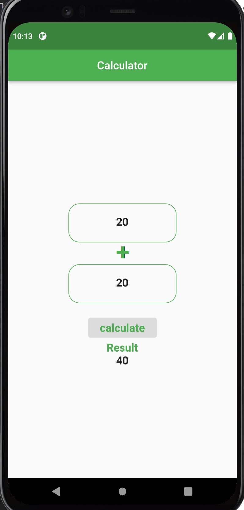

# UC-Flutter-hw-2

قم بعمل  برنامج يقوم بعمل عملية حسابية بسيطة وهي الجمع بحيث يأخذ البرنامج من المستخدم رقمين ثم يرجع ناتجهم 
- hint:
* 2 TextField widget 
* Text widget 
* Button widget

1. قم بعمل fork للـ repository
2. افتح الـ repository باستخدام github desktop
3. ادخل على برنامج VS code   وانشاء ملف تمرين داخل مجلد cw-1 في ال repository
4. قم بإنشاء برنامج Flutter جديد و احفظه داخل الملف
5. أضف MatiralApp  و Scofield للبرنامج
6. اضف دالة تقوم بعملية الجمع لرقمين
7. ثم اضف Column widget وبداخلها 2 textfield widget نستخدمها لأخذ الأرقام المراد جمعها ثم button widget يقوم باستدعاء الدالة التي سوف تقوم بالعملية الحسابية ثم text widget لعرض الناتج

## بونص
* قوم باضافة جميع العمليات الحسابية التي تقوم بها الالة الحاسبة (جمع - طرح - ضرب - قسمة)
